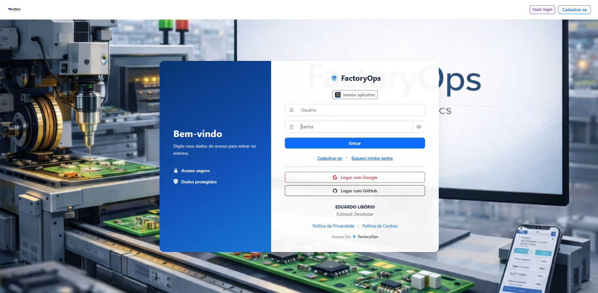
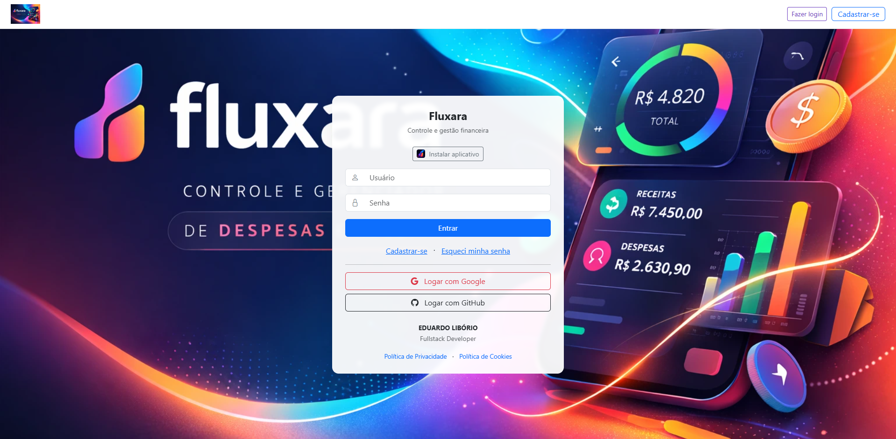

  
  
  
  

---

## 👨‍💻 About Me

> **FullStack Developer** focused on building structured, scalable web systems driven by real-world business logic.

My main expertise is **backend development with Python/Flask**, but I build complete applications — responsive UI, database integration, cloud deployment, and business-driven architecture.

Currently using **Railway** as cloud infrastructure and actively studying migration to **AWS** for greater scalability and architectural maturity.

**Highlights:**
- Layered architecture: `Routes → Services → Repositories`
- Multi-level approval workflows & business dashboards with KPIs
- OAuth integration (Google / GitHub) + session-based auth
- Progressive Web Apps (PWA) with offline support
- Clean Code principles and low-coupling design
- Deployment with separated `production` and `develop` environments

---

## 🛠️ Tech Stack

**Backend**

&nbsp;
&nbsp;
&nbsp;

**Frontend**

&nbsp;
&nbsp;
&nbsp;
&nbsp;

**Database & Infrastructure**

&nbsp;
&nbsp;
&nbsp;
-0D1117?style=for-the-badge&logo=amazonaws&logoColor=FF9900)&nbsp;

**Tools & Practices**

&nbsp;
&nbsp;
&nbsp;
&nbsp;

---

## 🚀 Featured Projects

> Real-world systems built with structured architecture and production-ready standards.

---

### 🏭 FactoryOps

Industrial operations management platform with multi-level approval workflows, business dashboards, and structured MVC architecture.

&nbsp;
&nbsp;
&nbsp;
&nbsp;
&nbsp;
&nbsp;

**[→ View Repository](https://github.com/eduardoliboriox/factoryops-venttos-prod)**

---

### 💸 Fluxara

Personal finance management app with real-time expense tracking, revenue dashboards, and KPI metrics. Clean and intuitive UI with secure authentication.

&nbsp;
&nbsp;
&nbsp;
&nbsp;
&nbsp;
&nbsp;

**[→ View Repository](https://github.com/eduardoliboriox/fluxara-app-prod)**

---

## 📊 GitHub Stats

  
  

  

---

